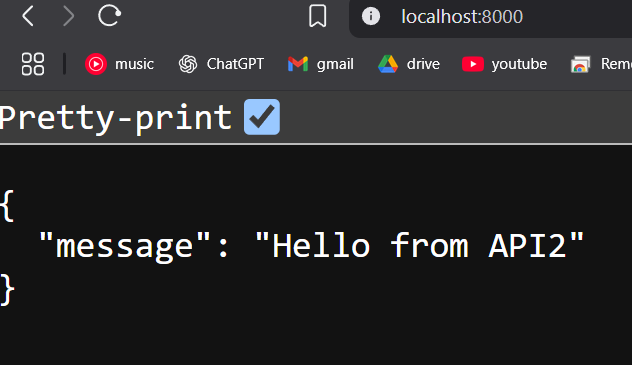

# FastAPI Docker Compose Example

This project demonstrates two FastAPI services communicating via Docker Compose.

## Architecture
- API1: Receives requests and forwards them to API2 (port 8000)
- API2: Simple API that returns a message (port 8001)

## Deployment
1. Ensure Docker and Docker Compose are installed
2. Clone this repository
3. Run: `docker-compose up --build`

## Testing
1. After deployment, access API1 at: `http://localhost:8000/`
2. You should see a response like: `{"message":"Hello from API2"}`
3. Check the logs to see the request flow between services:
   - API1 will log when it receives a request
   - API2 will log when it receives a request from API1
   - API1 will log the response from API2

## Notes
- API1 depends on API2 being available (handled by Docker Compose)
- Both services log their activity to stdout

### Examples API

